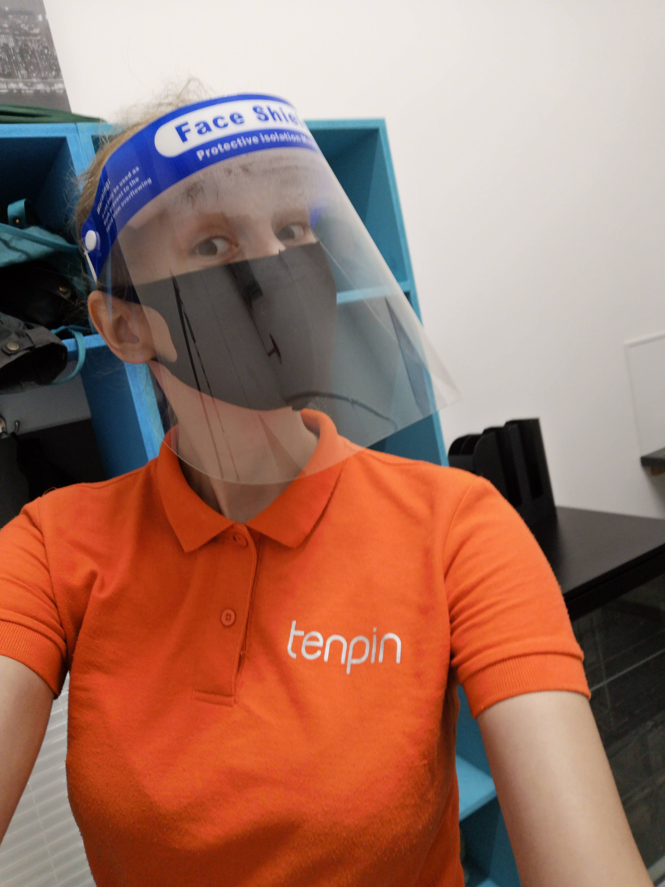

Work day!   

We wore masks and face covers and I washed dishes 2 hours straight.  

Standing for four hours was super weird and I was a bit knackered when I got home.  

But it was good to get out and talk to people.   

If everything goes well and this pandemic is finally going to easen, we might eventually be able to travel to see our families.  

Our lockdown took 155 days, ending on the 20th of August 2020.

My work attire. I would have never believed before this pandemic that one day I'd wear a mask and a visor for work.