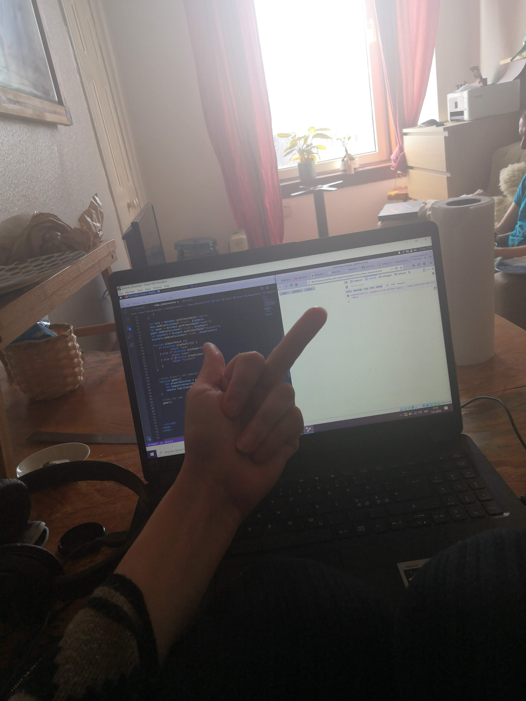

Max was up at 7am. We learnt the Finnish word "nappisilmä" (buttoneye).   

Anna was frustrated at code and Maxi with playstation but in the end everyone was happy although Anna tricked Maxi to stop his nap.

My first Rock-Paper-Scissor game didn't go as I wanted it